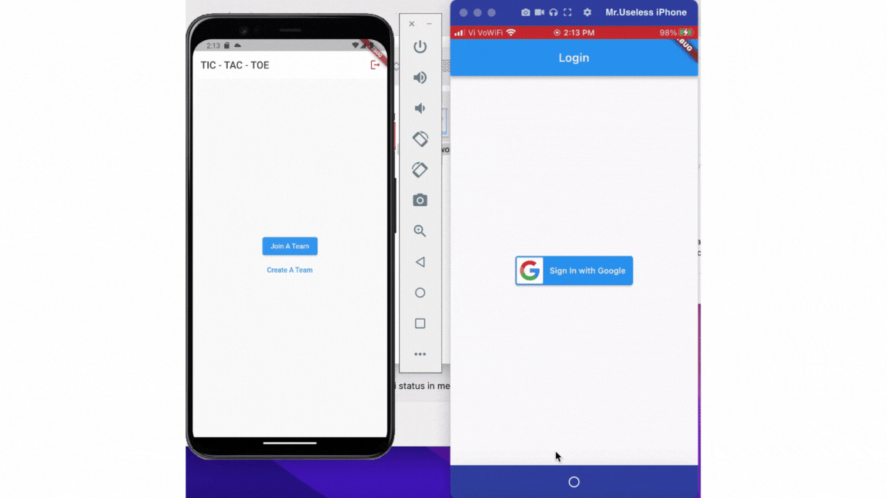
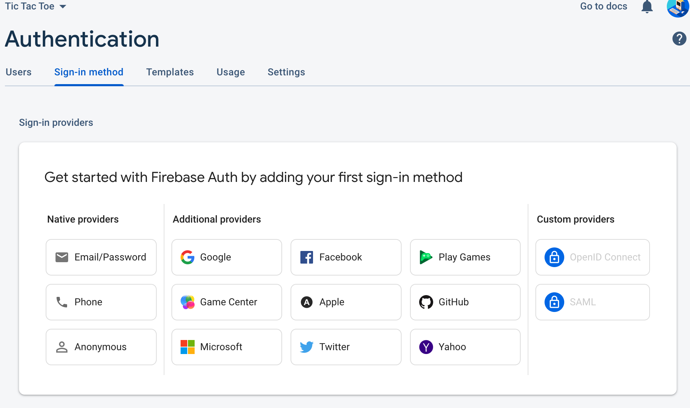
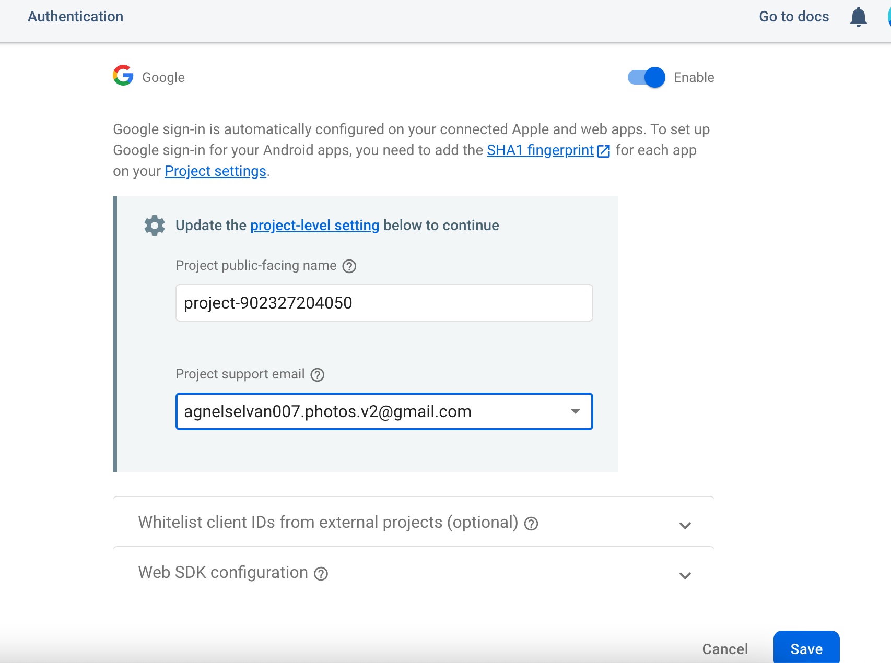
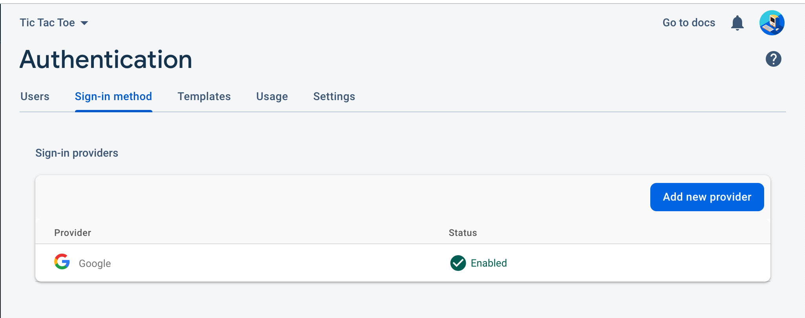
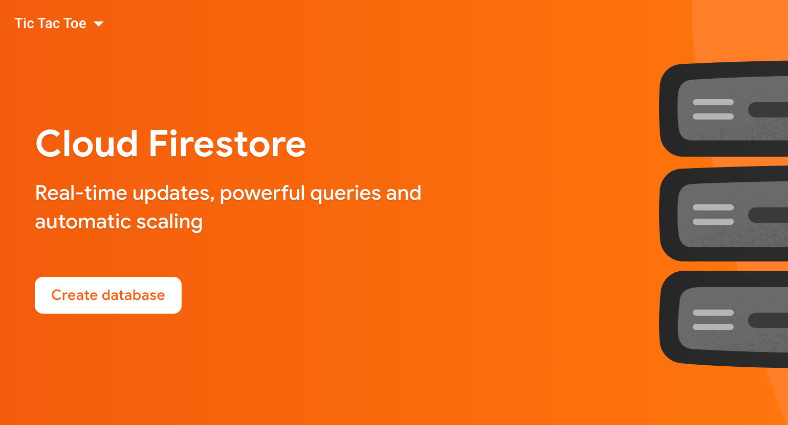
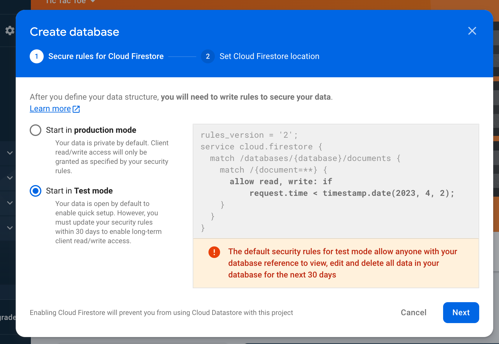

# TIC TAC TOE

TIC TAC TOE Multiplayer Game using Flutter and Firebase.



## Getting Started

### Flutter Setup
This project is a starting point for a Flutter application.

- [Download Flutter from their official website](https://docs.flutter.dev/get-started/install)

### Firebase Setup

- [Create a new Project in Firebase](https://console.firebase.google.com/u/0/)


#### Android Setup

- Enter the App's Pakage ID and SHA-1 Key

For generating SHA-1 key open the terminal of your project and type **cd android** and then enter
```dart
./gradlew signingReport
```
Copy SHA-1 Key and Paste it in Debug signing Certificate. 


click Register App

- Download the google-services.json file

and place the file inside *android/app/* folder.

- Enable the Google Authentication 


- Enabling the Google Login Functionality
Now Select Google from Additional Providers


Enable the Google Sign In and add your support Mail


We have Successfully done the setup for Google Login In Firebase



- Google Firestore Service from Firebase


Select the Test Mode and click on Next


Now inside Rules make the if condition to true and Publish the changes.


**Firebase setup has completed successfully.**

Now to run the application

Open the terminal and enter
```cmd
    git clone https://github.com/AgnelSelvan/Tic-Tac-Toe.git
```

and open the project in respective IDE and in Terminal enter
```cmd
    flutter pub get
```
 and now run the application.